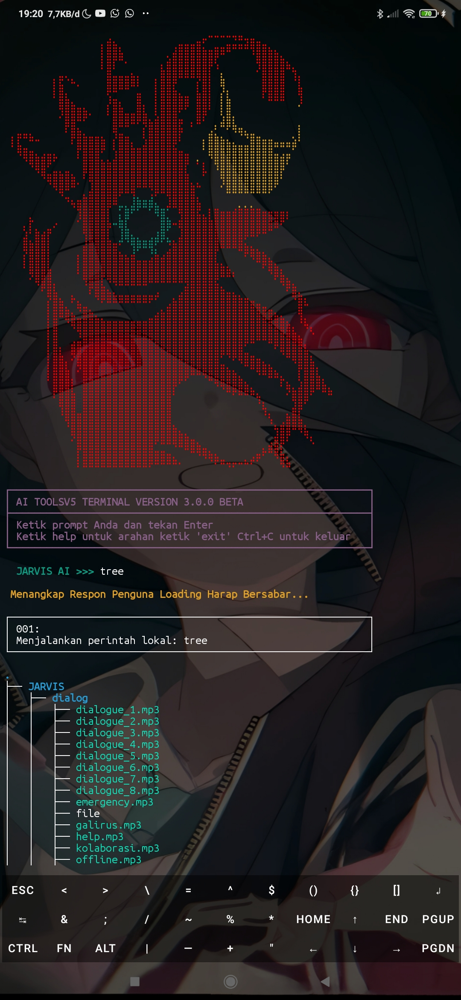

# JARVIS AI TERMUX V3.0.0 BETA

---

## Fitur

- Mode panel Termux menggunakan **tmux** untuk manajemen jendela dan pane yang fleksibel  
- Informasi **cuaca** terkini  
- **Track IP** untuk pelacakan alamat IP  
- **Kontrol Termux lewat AI** dengan perintah biasa

---

## Instalasi

Jalankan perintah berikut di Termux secara berurutan:
pkg udpate && pkg upgrade
pkg install neofetch curl jq git ossp-uuid -y
pkg install ncurses-utils xz-utils nodejs -y
pkg install nodejs-lts python python3 -y
pkg install openssl openssl-tool -y
npm -g i bash-obfuscate
pip install rich rich-cli
git clone https://github.com/Lubebansokhekel/JARVISV3
cd JARVISV3
bash JARVISV3.sh

text
---
ketik help untuk melihat semua fiturnya
---

## Donasi

Dukung pengembangan Jarvis AI Termux dengan donasi melalui Saweria:

[https://saweria.co/Galirus](https://saweria.co/Galirus)

Atau beli tool versi 5 seharga 15.000 IDR di:

[https://lynk.id/galirusofficial](https://lynk.id/galirusofficial)

---

Jarvis AI Termux mengubah Termux menjadi asisten cerdas dengan perintah suara dan teks, membantu otomatisasi dan interaksi yang lebih mudah di terminal.
